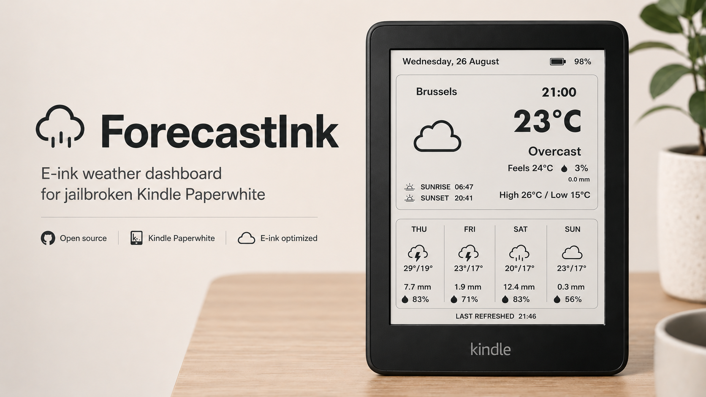
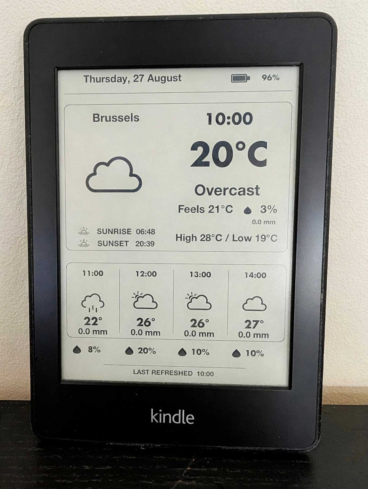
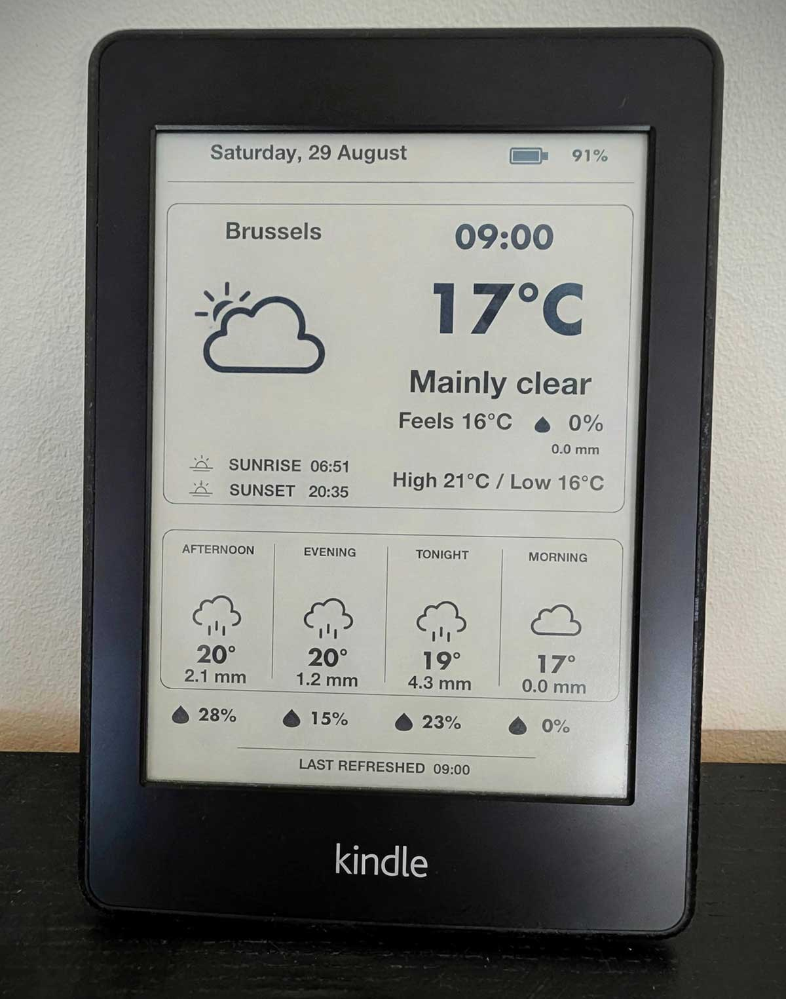
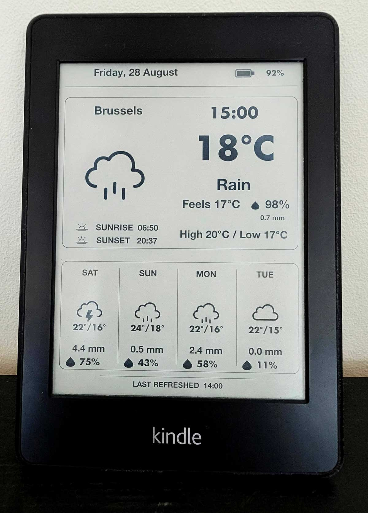

# ForecastInk

A low-power e-ink weather dashboard for jailbroken Kindles.



ForecastInk repurposes an old Kindle Paperwhite as a dedicated weather display. It fetches weather data, renders a clean portrait dashboard directly to the e-ink screen, then puts the Kindle back into deep sleep until the next scheduled refresh.

## Current features

- Current temperature and weather conditions
- Feels-like temperature
- Precipitation probability
- Precipitation amount in millimetres
- Daily high and low
- Sunrise and sunset
- Next-hours forecast
- Daypart forecast
- Multi-day forecast
- Cycling forecast views
- Direct previews for the Hourly, Dayparts, Daily, and all-views screens
- Meteocons monochrome weather icons
- Battery level
- Last-refreshed time
- Automatic hourly refresh
- Deep sleep between updates
- Fast exit to Kindle Home with a short power-button press
- Native USB wake and safe-eject recovery
- KUAL recovery action for restoring the Kindle UI

## Real-device preview

ForecastInk can cycle hourly between three forecast views:

<table>
  <tr>
    <td align="center" width="33%">
      <br>
      <strong>Hourly</strong><br>
      <sub>Upcoming individual hours</sub>
    </td>
    <td align="center" width="33%">
      <br>
      <strong>Dayparts</strong><br>
      <sub>Four broader periods of the day</sub>
    </td>
    <td align="center" width="33%">
      <br>
      <strong>Daily</strong><br>
      <sub>Multi-day forecast</sub>
    </td>
  </tr>
</table>

The interface is designed specifically for e-ink rather than adapted from a phone or desktop weather app. The Kindle spends most of its time suspended and wakes only when it needs to update.

## How it works

ForecastInk uses Open-Meteo weather data with the DWD ICON Seamless forecast model. FBInk renders the dashboard directly to the Kindle framebuffer, while RTC wake alarms provide the hourly update schedule.

A normal update cycle is:

1. Wake the Kindle using its RTC alarm
2. Allow Wi-Fi to reconnect
3. Fetch current conditions and forecast data
4. Render the selected forecast view
5. Suspend until the next hourly refresh

Because an e-ink display requires essentially no power to retain a static image, an old Kindle is unusually well suited to this job.

## Tested hardware

The v0.9.3 public beta has been physically tested with:

- Kindle Paperwhite 1
- Firmware 5.6.1.1
- KUAL
- FBInk
- Wi-Fi weather updates
- Hourly RTC suspend/wake cycles
- Short power-button exit to Kindle Home
- USB wake, Windows storage access, and safe eject

## Current status

ForecastInk is the successor to PaperCast. The current known-good public beta remains **PaperCast v0.9.3** while the new name and runtime directory are validated.

It includes Hourly, Dayparts, and four-day forecast views. Precipitation probability and precipitation amount are shown in the current conditions and forecast views where corresponding Open-Meteo data is available.

Live mode can return to Kindle Home in a few seconds after a short power-button press. USB wake keeps storage available to the connected computer, and safe eject returns directly to the normal Kindle interface without a reboot or long power-button reset. Restoring only the Kindle's Pillow UI layer avoids the tree/logo/progress startup sequence seen when the full UI stack is restarted.

## Requirements

- A jailbroken Kindle
- [KUAL](https://www.mobileread.com/forums/showthread.php?t=203326)
- Kindle Paperwhite 1 for the currently tested hardware target
- Firmware 5.6.1.1 for the currently tested firmware target

ForecastInk may work on other jailbroken Kindle models or firmware versions, but they have not yet been validated.

## Installation

1. Download and extract the ForecastInk release ZIP.
2. If upgrading from PaperCast v0.9.3 or earlier, save any custom `config.conf` values you want to keep.
3. Remove the old `/mnt/us/extensions/KindleDash/` extension directory. ForecastInk does not automatically migrate files from the legacy directory.
4. Copy the top-level `ForecastInk/` extension directory to `/mnt/us/extensions/` on the Kindle.
5. Confirm that the installed menu file is at `/mnt/us/extensions/ForecastInk/menu.json` and the launcher is at `/mnt/us/extensions/ForecastInk/bin/run.sh`.
6. Safely disconnect the Kindle, open KUAL, and select **ForecastInk**.
7. Choose a direct preview action, **Start ForecastInk — Hourly only**, or **Start ForecastInk — Cycle all 3 views**.

ForecastInk was previously released as PaperCast. PaperCast v0.9.3 and earlier used the `KindleDash/` directory shown above; the new `ForecastInk/` directory is a clean installation rather than an in-place rename.

Fresh installations do not need the legacy-directory removal step.

## Exiting ForecastInk

While ForecastInk is suspended, press the power button briefly to return to Kindle Home. On the tested PW1 this takes approximately one to three seconds and does not show the tree/logo/progress sequence.

Connecting USB while ForecastInk is suspended also exits live mode while leaving normal Kindle USB storage handling intact. After safely ejecting the drive, the Kindle returns to its normal Home/library interface. If the interface ever needs manual restoration, use **RECOVERY — Restore Kindle UI** from the ForecastInk KUAL menu.

## Configuration

Edit `/mnt/us/extensions/ForecastInk/config.conf` before starting live mode. For normal setup, enter a city and leave the resolved fields blank:

```conf
LOCATION="Bangkok"
LATITUDE=""
LONGITUDE=""
TIMEZONE=""
```

On the next launch, ForecastInk uses Open-Meteo's geocoding API to resolve the best matching latitude, longitude, and timezone. The successful result is cached on the Kindle, so normal hourly refreshes do not repeat the geocoding request. `LOCATION` remains the label shown on the dashboard.

A simple city name uses Open-Meteo's highest-ranked result. For ambiguous names, include a region or country in `LOCATION`:

```conf
LOCATION="London, Ontario"
# or LOCATION="Paris, Texas"
# or LOCATION="Cambridge, UK"
```

The `, UK` suffix is sent to Open-Meteo as `, United Kingdom`; the original `LOCATION` text remains the dashboard label and cache key.

| Setting | Purpose | Normal setup |
|---|---|---|
| `LOCATION` | City query and dashboard label | Required, for example `Bangkok` |
| `LATITUDE` | Exact forecast latitude | Leave blank for automatic setup |
| `LONGITUDE` | Exact forecast longitude | Leave blank for automatic setup |
| `TIMEZONE` | Exact IANA timezone | Leave blank for automatic setup |

For an exact point or maximum control, advanced users can bypass geocoding by supplying all three override values:

```conf
LOCATION="Brussels"
LATITUDE="50.87002"
LONGITUDE="4.40824"
TIMEZONE="Europe/Brussels"
```

Partial overrides are not mixed with geocoded values: either supply the complete latitude/longitude/timezone trio or leave all three blank. Changing `LOCATION` invalidates the previous location match and triggers one new lookup on the next launch.

## Weather data

ForecastInk uses:

- Open-Meteo for weather data and forecast delivery
- DWD ICON Seamless as the selected forecast model

The displayed current temperature and conditions are model-derived weather data. They are not measurements from a physical sensor attached to the Kindle, so they can differ from nearby weather stations or other services—especially during rapidly changing conditions.

## Current limitations

- Currently optimized and tested only on Kindle Paperwhite 1
- Portrait orientation only
- Current conditions are model-derived rather than measured by a local physical sensor
- Other Kindle models have not yet been validated

## Roadmap

- Landscape mode
- Additional Kindle model testing
- Public installation cleanup

## Project philosophy

ForecastInk is deliberately simple: reuse hardware that might otherwise sit in a drawer and turn it into a quiet, low-power information display.

No browser. No glowing LCD. No constant animation. Just weather on e-ink.

## Credits and attribution

ForecastInk builds on excellent open-source projects and public weather services:

- [Open-Meteo](https://open-meteo.com/) — weather API and forecast delivery; API data are licensed under [CC BY 4.0](https://creativecommons.org/licenses/by/4.0/)
- [DWD ICON](https://www.dwd.de/EN/ourservices/nwp_forecast_data/nwp_forecast_data.html) — forecast model data produced by © Deutscher Wetterdienst
- [FBInk](https://github.com/NiLuJe/FBInk) — Kindle framebuffer rendering, licensed GPL-3.0-or-later
- [Meteocons](https://github.com/basmilius/meteocons) — monochrome weather icon source, licensed MIT

Weather data by [Open-Meteo.com](https://open-meteo.com/) (CC BY 4.0), adapted for display by ForecastInk. Forecast model data are based on DWD ICON Seamless, © Deutscher Wetterdienst.

## License

ForecastInk's original source code, documentation, and project-owned artwork are licensed under the [MIT License](LICENSE). Bundled third-party binaries and artwork retain their own licenses; see [THIRD_PARTY_NOTICES.md](THIRD_PARTY_NOTICES.md) for exact versions, source links, notices, and data-attribution requirements.
