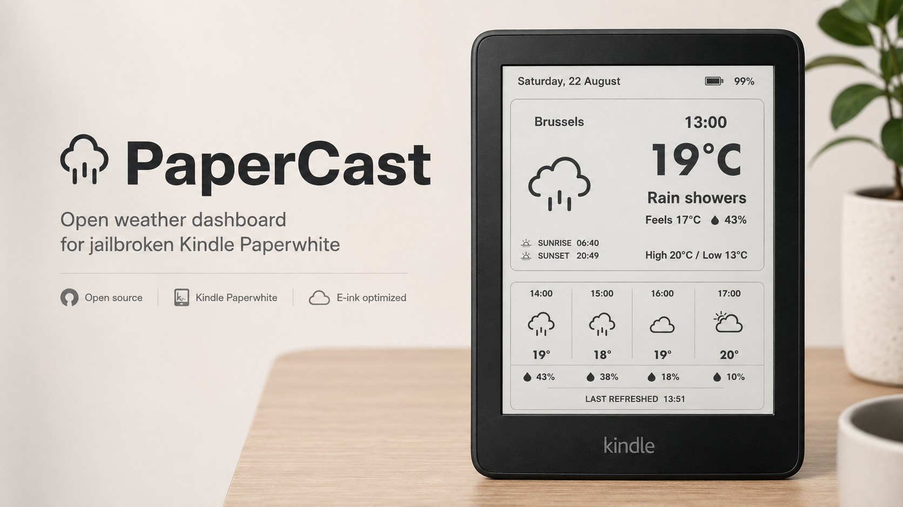
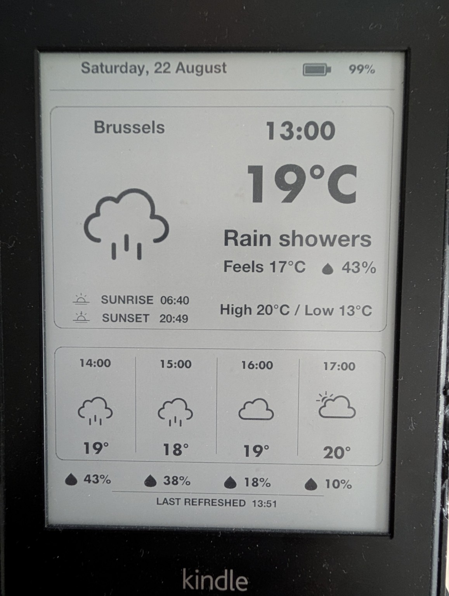

# PaperCast

**Turn an old jailbroken Kindle Paperwhite into a low-power e-ink weather dashboard.**



PaperCast repurposes an old Kindle Paperwhite as a dedicated always-on weather display. It fetches weather data, renders a clean e-ink dashboard, then puts the Kindle back to sleep until the next scheduled refresh.

The current build has been developed and tested on real Kindle Paperwhite 1 hardware.

## What it shows

PaperCast currently displays:

- Current temperature and weather conditions
- Feels-like temperature
- Current precipitation probability
- Daily high and low
- Sunrise and sunset
- Four-hour forecast
- Hourly precipitation probability
- Weather icons using Meteocons
- Battery level
- Last refresh time
- Additional cycling forecast views
- Automatic hourly refresh

## Real-device preview

This is PaperCast running on the actual Kindle Paperwhite 1 used during development:



The interface is designed specifically for e-ink rather than adapted from a phone or desktop weather app. The Kindle spends most of its time suspended and wakes only when it needs to update.

## How it works

PaperCast uses:

- **Open-Meteo** for weather data
- **DWD ICON** as the currently selected forecast model
- **FBInk** for direct framebuffer rendering
- **KUAL** to launch PaperCast on a jailbroken Kindle
- RTC wake alarms to wake the Kindle for scheduled refreshes

A typical cycle is:

1. Wake the Kindle
2. Allow Wi-Fi to reconnect
3. Fetch current weather and forecast data
4. Render the dashboard
5. Suspend again until the next refresh

Because an e-ink screen requires essentially no power to keep a static image visible, an old Kindle is unusually well suited to this job.

## Current status

PaperCast is currently a **beta / pre-v1 release**.

Current known-good build: **beta76**

Tested on:

- Kindle Paperwhite 1
- Firmware 5.6.1.1
- KUAL
- FBInk
- Wi-Fi weather updates
- Hourly RTC suspend / wake cycles

Other Kindle models have not yet been validated.

## Installation

Public installation instructions are being prepared.

PaperCast currently requires a jailbroken Kindle with KUAL installed.

The runtime extension is installed under the Kindle extensions directory and launched from KUAL.

A packaged public release with step-by-step installation instructions will be provided before v1.0.

## Configuration

The current development build uses configurable values for:

```conf
LOCATION="Brussels"
LATITUDE="50.87002"
LONGITUDE="4.40824"
TIMEZONE="Europe/Brussels"
```

For the public release, configuration will be simplified so users can set their own location without editing project code.

City-name-only automatic location lookup is planned.

## Weather data

PaperCast currently uses Open-Meteo with the DWD ICON model for current and forecast weather data.

The displayed current temperature is model-derived weather data, not a measurement from a physical sensor attached to the Kindle.

Forecast-model conditions can therefore differ from local weather stations or other weather services, particularly during rapidly changing conditions.

## Battery use

PaperCast is designed around deep sleep rather than leaving the Kindle awake continuously.

The current build:

- Refreshes once per hour
- Wakes Wi-Fi only when needed
- Redraws the e-ink screen
- Suspends again between updates

Real-world battery-life testing is still ongoing.

## Roadmap to v1.0

Planned work before the first stable release includes:

- Clean exit back to the normal Kindle interface without rebooting
- Easier location setup
- Runtime/project naming cleanup from legacy `KindleDash` references
- Landscape mode
- Installation documentation
- Additional real-device testing
- Licensing and attribution cleanup
- Testing on more Kindle models

## Project philosophy

PaperCast is deliberately simple: reuse hardware that would otherwise sit in a drawer and turn it into a quiet, low-power information display.

No browser. No glowing LCD. No constant animation. No account required just to discover whether it might rain.

Just weather on e-ink.

## Credits

PaperCast builds on excellent open-source work and public weather services, including:

- [Open-Meteo](https://open-meteo.com/)
- [FBInk](https://github.com/NiLuJe/FBInk)
- [Meteocons](https://github.com/basmilius/weather-icons)

Additional licensing and bundled-component attribution will be finalized before the public v1.0 release.

## License

Project license to be finalized before the public v1.0 release.
